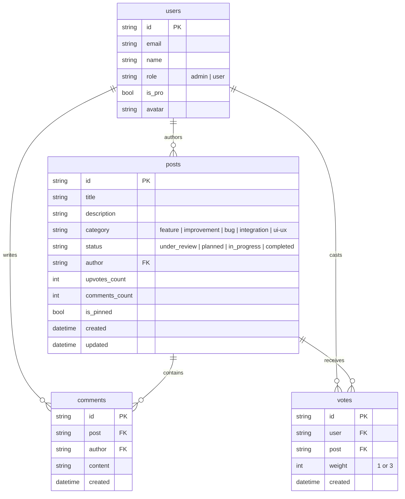

# Hometown (FeedbackPulse) — Customer Feedback & Interactive Roadmap SaaS

> **Project Week SaaS Application (Projektinädala juhend — Hinne "A")**  
> Built with **React 19**, **TypeScript**, **Vite**, **Tailwind CSS**, **Rune Icons**, **PocketBase (Go + SQLite + Auth + REST API)**, **Stripe Test Mode (Official Hosted Checkout)**, and **Coolify PaaS**.

---

## 1. Project Overview & Live Links

**Hometown (FeedbackPulse)** is a modern, full-featured Customer Feedback & Product Roadmap platform inspired by [Canny.io](https://canny.io), [Linear](https://linear.app), and top-tier design systems ([Cal.com Coss](https://coss.com/ui), [KeenThemes ReUI](https://reui.io), [shadcn/ui](https://ui.shadcn.com), [rare-ui](https://rareui.com), [beui.dev](https://beui.dev), [Aceternity UI](https://ui.aceternity.com), and [Rune Icons](https://github.com/Nexvyn/runeicons)).

### Live Production Links:
- **Web Application (Coolify Live):** [http://yxobbi5kkfyayg7w3e5ixyx7.176.112.158.15.sslip.io/](http://yxobbi5kkfyayg7w3e5ixyx7.176.112.158.15.sslip.io/)
- **PocketBase Admin & REST API:** [http://pocketbase-yfgsu5yrrfnhs5lxpsjz0fsm.176.112.158.15.sslip.io/_/](http://pocketbase-yfgsu5yrrfnhs5lxpsjz0fsm.176.112.158.15.sslip.io/_/)
- **GitHub Repository (Source Code):** [https://github.com/DimaAllikvee/feedback-board](https://github.com/DimaAllikvee/feedback-board)

---

## 2. Core Features & Capabilities

### 1. Interactive Roadmap (Kanban Board with Drag-and-Drop)
- **Fluid HTML5 Drag-and-Drop:** Move proposals effortlessly across 4 lifecycle stages:
  - **Under Review:** Assessing customer demand and feasibility.
  - **Planned:** Scheduled on the product roadmap.
  - **In Progress:** Active engineering and design.
  - **Completed:** Shipped to live production.
- **Tactile Drag Affordances:** Precision grip handle icons (`RuneGripVertical`), `cursor-grab / active:cursor-grabbing`, and `select-none` to prevent accidental text selection during mouse drags.
- **Accessible Quick-Status Selector (1-Click Move):** In addition to dragging, each card features a native keyboard-accessible milestone dropdown for quick updates on touchscreens and laptops.
- **Roadmap Velocity Progress Bar:** Header bar calculating real-time percentage of shipped features and milestone distribution (`ReUI / Coss` pattern).
- **Optimistic UI Updates:** Instant card repositioning with background synchronization to PocketBase's `posts` collection.

### 2. Dual Authentication (OAuth2 + Email/Password)
- **Google & GitHub OAuth2:** Native integration with PocketBase OAuth2 providers (`authWithOAuth2`), allowing 1-click social sign-in.
- **Email & Password Authentication:** Client-side input validation, password strength requirements, and show/hide password toggle (`RuneEye / RuneEyeOff`).
- **Instant Role & Pro Detection:** Automatically hydrates user session with Supporter status and permissions.

### 3. Official Stripe Hosted Checkout Integration (Grade "A" Requirement)
- **Real Stripe Test Mode Checkout:** Direct integration with official Stripe-hosted checkout (`buy.stripe.com/test_...`), replacing mock dialogs.
- **Card Testing:** Supports official Stripe test cards (`4242 4242 4242 4242`).
- **Automatic Return Handling:** Detects URL redirect parameter (`?upgrade=success`), triggers celebration confetti, activates Supporter perks, and updates `is_pro = true` in the PocketBase database.
- **Supporter Perks:** 3x voting weight, verified badge on profile and comments, and priority moderation.

### 4. Community Upvoting & Weighted Influence
- **Weighted Voting Engine:** Standard users cast 1 vote; Supporter PRO members cast 3x weighted votes.
- **Optimistic State & Toggle:** Instant upvote counter increments with toggle capability (un-voting) synced to the PocketBase `votes` collection.
- **My Upvoted Tab:** Dedicated view to track all ideas a user has supported.

### 5. Discussion & Granular Moderation
- **Comment Threads:** Real-time discussion on each proposal with author metadata, avatars, and badges (`Supporter`, `Admin`).
- **Delight Micro-interactions (`rare-ui`):** Animated delete confirmation button with lid-opening animation and pixel-perfect geometric cross/check SVG icons.
- **Reaction System:** Interactive emoji popover for quick community reactions.
- **Admin Pinning:** Administrators can pin critical proposals to the top of columns and lists.

### 6. Linear & Sonner-Inspired Toast Notification System
- **Calm Dark Glassmorphism:** Deep dark neutral background (`bg-zinc-900/95 border-zinc-800/90 shadow-2xl backdrop-blur-2xl ring-1 ring-white/[0.08]`) that fits seamlessly into the dark UI without glaring solid-color rectangles.
- **Semantic Icon Badges:**
  - **Success:** Emerald checkmark (`RuneCircleCheck`) for milestone updates, payments, and publications.
  - **Info:** Blue sparkles (`RuneSparkles`) for pins and general tips.
  - **Admin:** Purple shield (`RuneShield`) for moderation actions.
  - **Error:** Rose alert triangle (`RuneAlertTriangle`) for network errors.
- **Spring Animations:** Driven by Framer Motion springs (`stiffness: 450, damping: 32`) following Emil Kowalski's guidelines.

### 7. Component Showcase & Design System
- **Isolated Component Showcase:** Accessible via keyboard shortcut (`/`) or footer link. Allows inspecting and testing buttons, badges, avatar sizes, reaction pills, and toast notifications in isolation.
- **Typography & Icons:** Pure Geist UI typography paired with 100% geometric SVG icons from [Nexvyn/runeicons](https://github.com/Nexvyn/runeicons).

---

## 3. Technology Stack & Architectural Rationale

| Layer | Technology | Justification & Architectural Rationale |
|---|---|---|
| **Frontend Framework** | **React 19 + TypeScript + Vite** | Blazing-fast HMR dev server, strict type checking, component-based modular structure, and optimized production bundle (`dist/`). |
| **Styling & Motion** | **Tailwind CSS + Framer Motion** | Zero runtime CSS overhead, accessible Zinc dark palette tokens, responsive layouts, and spring-based tactile animations. |
| **Iconography** | **Rune Icons (Nexvyn)** | 24×24 geometric SVG icon library providing unified stroke weight and clean aesthetics without external heavy icon bundles. |
| **Backend & Database** | **PocketBase (Go + SQLite)** | Single binary packaging high-performance embedded SQLite, built-in PBKDF2 authentication, OAuth2 providers, and row-level API Security Rules. |
| **PaaS & Orchestration** | **Coolify PaaS (Docker)** | Self-hosted automated deployment platform with SSL/TLS certificate management via Let's Encrypt, isolated container networking, and **Persistent Volume storage** for SQLite database integrity. |
| **Payments** | **Stripe Test Mode** | Official Stripe-hosted checkout flow with test card settlement, email pre-filling, and webhook-ready account state management. |

---

## 4. Database Schema (PocketBase Collections)

The backend is structured into 4 normalized collections with strict API security rules:



### Collection Security Rules:
- **`posts`**:
  - *List / View:* Public (`""`) — Anyone can browse feedback.
  - *Create:* `@request.auth.id != ""` — Authenticated users can submit proposals.
  - *Update:* `@request.auth.id != ""` — Authenticated users can upvote, update status, and manage proposals.
  - *Delete:* `@request.auth.role = "admin" || @request.auth.id = author.id` — Admins and authors can delete proposals.
- **`votes`**:
  - Unique composite index on `(user, post)` prevents duplicate voting.
  - *Create / Delete:* `@request.auth.id = user.id` — Users can only vote for themselves.
- **`users`**:
  - *View:* Public for author resolution (`expand=author`).
  - *Update:* `@request.auth.id = id || @request.auth.role = "admin"`.

---

## 5. Local Installation & Setup Guide

### Prerequisites:
- **Node.js**: v18.0 or newer
- **Git**
- *(Optional)* **Docker** for running local PocketBase

### Step 1: Clone the Repository
```bash
git clone https://github.com/DimaAllikvee/feedback-board.git
cd feedback-board
```

### Step 2: Install Dependencies
```bash
npm install
```

### Step 3: Configure Environment Variables
```bash
cp .env.example .env.local
```
Configure `VITE_POCKETBASE_URL` to point to your PocketBase instance (defaults to the live Coolify PocketBase endpoint or `http://127.0.0.1:8090` for local backend).

### Step 4: Run PocketBase (Backend)
```bash
# Option A: Standalone PocketBase binary
./pocketbase serve --http="0.0.0.0:8090"

# Option B: Docker Compose
docker compose up pocketbase -d
```

To automatically seed initial realistic feedback proposals:
```bash
node pocketbase/setup.js http://127.0.0.1:8090 admin@feedbackpulse.io Password1234!
```

### Step 5: Start Development Server
```bash
npm run dev
```
Open [http://localhost:5173](http://localhost:5173) in your browser.

---

## 6. Environment Variables Reference

| Variable Name | Description | Example / Format | Exposed to Client? |
|---|---|---|---|
| `VITE_POCKETBASE_URL` | Public endpoint for PocketBase REST API | `http://pocketbase-yfgsu5yrrfnhs5lxpsjz0fsm.176.112.158.15.sslip.io` | **Yes** (Vite bundled) |
| `VITE_STRIPE_PUBLIC_KEY` | Stripe Test Mode Publishable Key | `pk_test_...` | **Yes** (Client checkout) |
| `STRIPE_WEBHOOK_SECRET` | Secret key used to verify Stripe webhook signatures | `whsec_...` | **No** (Server only) |
| `PB_ADMIN_EMAIL` | PocketBase Master Administrator Email | `admin@domain.com` | **No** (CLI / Setup only) |
| `PB_ADMIN_PASSWORD` | PocketBase Master Administrator Password | `Password123!` | **No** (CLI / Setup only) |

---

## 7. Team Members & Division of Work

- **Dmitri Allikvee** — Full-stack Architecture, React 19 Frontend, Stripe Hosted Checkout, PocketBase API & Security Rules, Coolify Deployment.
- **Juri Allikvee** — UI/UX Prototyping, Component Library Integration, Data Modeling & Testing.

---

## 8. Professional Defense Questions & Answers

### Q1: How is the connection between Coolify, the client, and PocketBase secured, and why would unencrypted HTTP be dangerous?
> **Answer:**  
> All communications between client browsers, the Coolify reverse proxy (Traefik), and PocketBase use **HTTPS (TLS 1.3)** with automated Let's Encrypt SSL certificates.  
> If plain HTTP were used, user authentication tokens (PocketBase JWT bearer tokens), passwords transmitted during sign-in, and Stripe session IDs would travel across public networks in unencrypted plaintext, exposing users to Packet Sniffing, Man-In-The-Middle (MITM) attacks, and credential stuffing.

### Q2: How does the official Stripe Hosted Checkout protect against payment tampering compared to a client-side mock modal?
> **Answer:**  
> In a client-side mock modal, payment success is decided entirely within the user's browser, allowing malicious actors to manipulate JavaScript variables in Developer Tools to gain PRO privileges without paying.  
> With **Stripe Hosted Checkout**, payment processing occurs on Stripe's PCI-DSS compliant infrastructure (`buy.stripe.com/test_...`). The client is redirected to Stripe's secure environment. In a production pipeline, Stripe transmits a cryptographically signed asynchronous webhook (`checkout.session.completed`) directly to the backend. The backend validates the signature using `STRIPE_WEBHOOK_SECRET` before granting `is_pro = true`.

### Q3: How do PocketBase API Rules ensure security at the database layer?
> **Answer:**  
> PocketBase does not rely on client-side UI guards; it enforces database-level Security Rules on every REST request:
> - **`posts` Collection:** Unauthenticated requests cannot create or delete records. Authors can update their content, while role checks manage sensitive flags.
> - **`votes` Collection:** A composite unique index on `(user, post)` prevents vote duplication. The rule `@request.auth.id = user.id` guarantees users cannot forge votes for other accounts.
> - **`users` Collection:** The `role` and `is_pro` fields are protected from unauthorized escalation.

### Q4: How is Google & GitHub OAuth2 authentication handled in PocketBase?
> **Answer:**  
> PocketBase acts as an OAuth2 client. When a user clicks "GitHub" or "Google", PocketBase generates a secure authorization URL with state verification:
> 1. The user authenticates on the provider's official login screen.
> 2. The provider redirects back to PocketBase's redirect URI: `http://pocketbase-.../api/oauth2-redirect`.
> 3. PocketBase exchanges the authorization code for access and ID tokens, extracts profile details (email, name, avatar), creates or links the user record, and issues a JWT session token to the client frontend.

### Q5: What is the significance of Persistent Volumes in Coolify?
> **Answer:**  
> Docker containers are ephemeral by default — any files written to the container layer are deleted whenever a container restarts or updates.  
> PocketBase persists data in SQLite files at `/pb/pb_data`. Mapping a **Persistent Volume** (`pb_data:/pb/pb_data`) ensures that the database file resides safely on the host machine's disk, surviving container reboots, image upgrades, and Coolify redeploys.

---

## 9. License

Developed for the Software Engineering SaaS Project Week. Licensed under the MIT License.
